<div align="center">

  <br />

  

  # 🌿 VIVA — Video Conferencing
  ### *Ultra-Low Latency Peer-to-Peer Video Meetings with Zero Friction*

  <p align="center">
    <strong>A state-of-the-art, open-source video communication suite built with native WebRTC, Socket.io, React 19, and Clerk Authentication.</strong>
  </p>

  <p align="center">
    <a href="#-key-features">Features</a> •
    <a href="#-architecture--webrtc-flow">Architecture</a> •
    <a href="#-tech-stack">Tech Stack</a> •
    <a href="#-quick-start">Quick Start</a> •
    <a href="#-project-structure">Structure</a> •
    <a href="#-security--privacy">Security</a>
  </p>

  <p align="center">
    
    
    
    
    
    
    
  </p>

</div>

---

## 🌟 Why VIVA?

Traditional meeting apps rely on expensive third-party video SDKs, heavy tracking, and clunky interfaces. **VIVA** is built from the ground up for speed, privacy, and aesthetic excellence:

* ⚡ **100% Free Peer-to-Peer**: Powered directly by native browser WebRTC and Google's public STUN infrastructure — **zero video SDK fees**.
* 🎨 **Deep Olive & Luminous Pista Theme**: Styled with modern glassmorphism cards, ambient shader backdrops, and fluid micro-animations.
* 🛡️ **Host Admission & Waiting Room**: Complete control for meeting hosts to **Admit** or **Deny** participants knocking at the room door.
* 🔒 **Clerk Authentication**: Streamlined Google OAuth and email sign-in seamlessly styled to match the app's palette.

---

## ✨ Key Features

<table>
  <tr>
    <td width="50%">
      <h3>📹 Crystal HD Video & Audio</h3>
      <p>Peer-to-peer WebRTC mesh network with dynamic audio analyser for active speaker detection and smooth track management.</p>
    </td>
    <td width="50%">
      <h3>🖥️ Lossless Screen Sharing</h3>
      <p>One-click display media streaming with automatic audio capture and instant peer video track replacement.</p>
    </td>
  </tr>
  <tr>
    <td width="50%">
      <h3>🚪 Host Admission Waiting Room</h3>
      <p>Attendees knock to request entry; the host receives real-time admission prompts to approve or decline guests.</p>
    </td>
    <td width="50%">
      <h3>💬 Live In-Meeting Chat</h3>
      <p>Synchronous real-time messaging powered by Socket.io with instant multi-user broadcasts.</p>
    </td>
  </tr>
  <tr>
    <td width="50%">
      <h3>📊 Real Meeting Session Logs</h3>
      <p>Persistent meeting history dashboard that automatically stores past calls, durations, participant counts, and chat logs.</p>
    </td>
    <td width="50%">
      <h3>🔗 Smart Meeting Code Resolver</h3>
      <p>Join effortlessly by either typing room codes (e.g. <code>abc-def-ghi</code>) or pasting full invitation URLs.</p>
    </td>
  </tr>
</table>

---

## 🏗️ Architecture & WebRTC Flow

```mermaid
sequenceDiagram
    autonumber
    actor Guest as Guest (Attendee)
    actor Host as Meeting Host (Admin)
    participant Server as Socket.io Signaling Server
    participant STUN as Google STUN (P2P NAT)

    Host->>Server: join-room (roomId, isHost: true)
    Guest->>Server: request-join (roomId, userName)
    Server->>Host: join-request-received (requesterInfo)
    Note over Host: Host sees floating Admission Card
    Host->>Server: approve-join-request (approved: true)
    Server->>Guest: join-response (approved: true)
    Guest->>Server: join-room (roomId)
    
    rect rgb(20, 48, 22)
        Note over Guest,Host: WebRTC Signaling Phase
        Guest->>STUN: Discover ICE Candidates
        Host->>STUN: Discover ICE Candidates
        Guest->>Server: webrtc-offer
        Server->>Host: webrtc-offer
        Host->>Server: webrtc-answer
        Server->>Guest: webrtc-answer
        Guest->>Server: ice-candidate
        Server->>Host: ice-candidate
    end

    Note over Guest,Host: 🟢 Direct Encrypted P2P Media Streaming
```



---

## 📂 Project Structure

```bash
Viva-Meeting-app/
├── 📁 client/                       # Frontend React Application
│   ├── 📁 src/
│   │   ├── 📁 assets/               # Static assets and icons
│   │   ├── 📁 components/           # UI Components
│   │   │   ├── 📁 meeting/          # VideoGrid, VideoTile, ControlBar, Header
│   │   │   │   ├── join_meeting_modal.tsx  # Guest Pre-Join & Name Entry
│   │   │   │   ├── new_meeting_modal.tsx   # Host Meeting Creator
│   │   │   │   └── transcript_panel.tsx    # Live Chat & Participant Drawer
│   │   │   ├── navbar.tsx           # Navigation with Clerk User Profile
│   │   │   └── protected_route.tsx  # Clerk Auth Guard
│   │   ├── 📁 config/               # Socket & Axios clients
│   │   ├── 📁 hooks/                # useWebRTC.ts & useChat.ts
│   │   ├── 📁 pages/                # Dashboard, MeetingRoom, Sessions, Login
│   │   ├── 📁 utils/                # session_storage.ts (Meeting Persistence)
│   │   └── main.tsx                 # ClerkProvider Theme Configuration
│   ├── .env.example                 # Client Environment Template
│   └── vite.config.ts
│
├── 📁 server/                       # Backend Node.js & Socket.io Server
│   ├── 📁 src/
│   │   ├── 📁 config/               # Database & Pool configs
│   │   ├── 📁 controllers/          # Meeting REST controllers
│   │   ├── 📁 routes/               # API endpoints
│   │   ├── socket.ts                # Real-Time WebRTC Signaling & Admission
│   │   └── server.ts                # Express bootstrap
│   └── .env.example                 # Server Environment Template
│
└── README.md
```

---

## ⚡ Quick Start

### 1. Clone the repository
```bash
git clone https://github.com/Divyezh/Viva-Meeting-app.git
cd Viva-Meeting-app
```

---

### 2. Backend Setup
```bash
cd server
npm install
cp .env.example .env
```

Configure your `server/.env`:
```env
PORT=5000
CLIENT_URL=http://localhost:5173
CLERK_SECRET_KEY=sk_test_your_clerk_secret_key    # Optional
DATABASE_URL=postgresql://...                     # Optional (In-memory fallback enabled)
```

Run the server:
```bash
npm run dev
```
> Server running at: `http://localhost:5000`

---

### 3. Frontend Setup
Open a new terminal:
```bash
cd client
npm install
cp .env.example .env
```

Configure your `client/.env`:
```env
VITE_CLERK_PUBLISHABLE_KEY=pk_test_your_clerk_key
VITE_API_URL=http://localhost:5000
VITE_SOCKET_URL=http://localhost:5000
```

Run the frontend:
```bash
npm run dev
```
> App running at: `http://localhost:5173`

---

## 🎛️ Meeting Controls & Shortcuts

| Action | Control | Description |
| :--- | :---: | :--- |
| **Microphone** | `Mic Button` | Instant hardware audio toggle with speech level wave indicator |
| **Camera** | `Camera Button` | Video track pause/resume with animated avatar fallback |
| **Screen Share** | `Monitor Button` | Full HD display media sharing with audio pass-through |
| **Live Chat** | `Message Button` | Slide-out glassmorphic drawer for synchronous room chat |
| **Participant List** | `Users Button` | Real-time participant roster with host/guest badges |
| **Copy Invite** | `Header Pill` | 1-click copy meeting room ID or full invitation URL |
| **Host Admission** | `Admit / Deny` | Real-time interactive toast card for managing waiting room |

---

## 🛡️ Security & Data Privacy

* 🔐 **No API Keys in Git**: Environment variables and secrets are strictly ignored.
* 🔒 **Encrypted P2P Media**: Audio and video streams are encrypted end-to-end via **SRTP/DTLS**.
* 🌐 **Zero Video Data Stored**: Video calls flow directly between browser peers and never touch an intermediary video server.

---

## 🤝 Contributing

Contributions, issues, and feature requests are welcome!

1. Fork the Project
2. Create your Feature Branch (`git checkout -b feature/AmazingFeature`)
3. Commit your Changes (`git commit -m 'Add some AmazingFeature'`)
4. Push to the Branch (`git push origin feature/AmazingFeature`)
5. Open a Pull Request

---

<div align="center">
  <p>Built with 💚 by <a href="https://github.com/Divyezh"><strong>Divyesh Soni</strong></a></p>
  <p>⭐ Star this repository if you find it helpful!</p>
</div>
